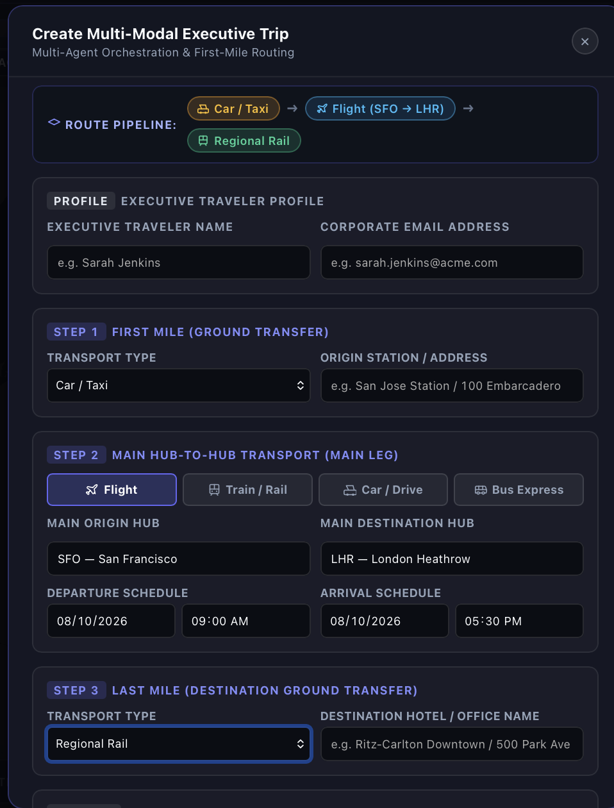
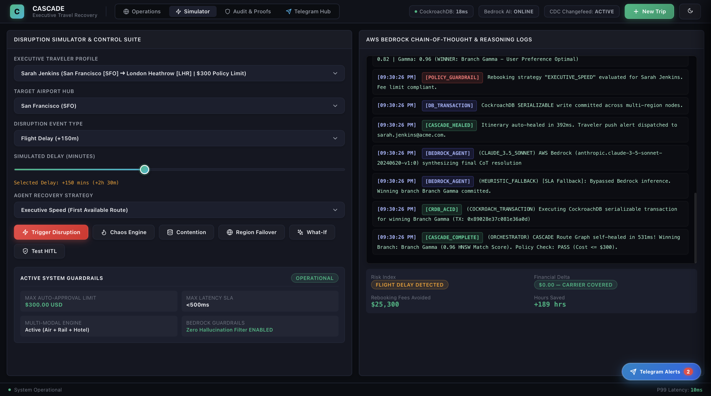
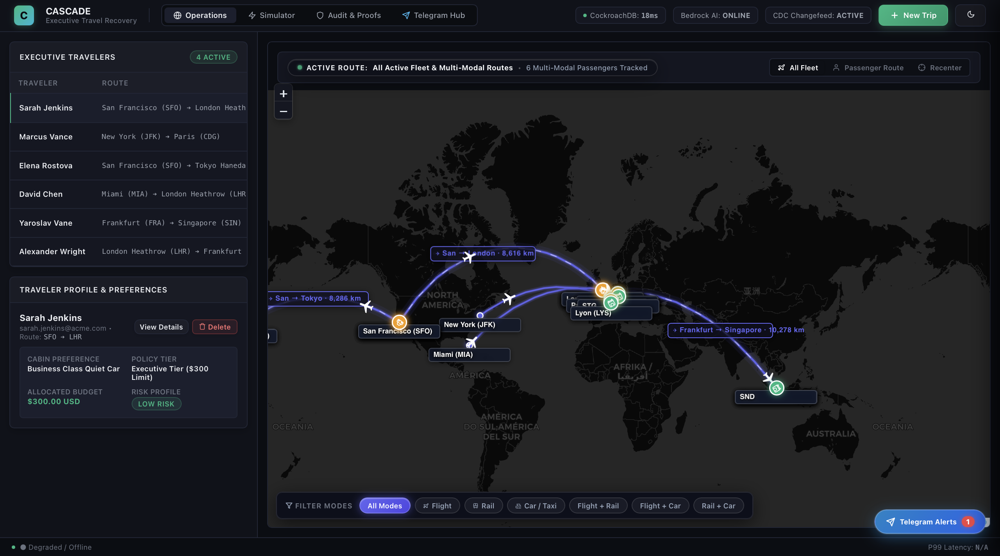
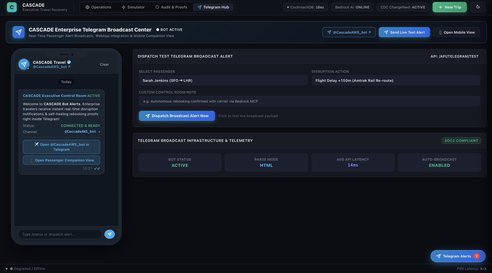
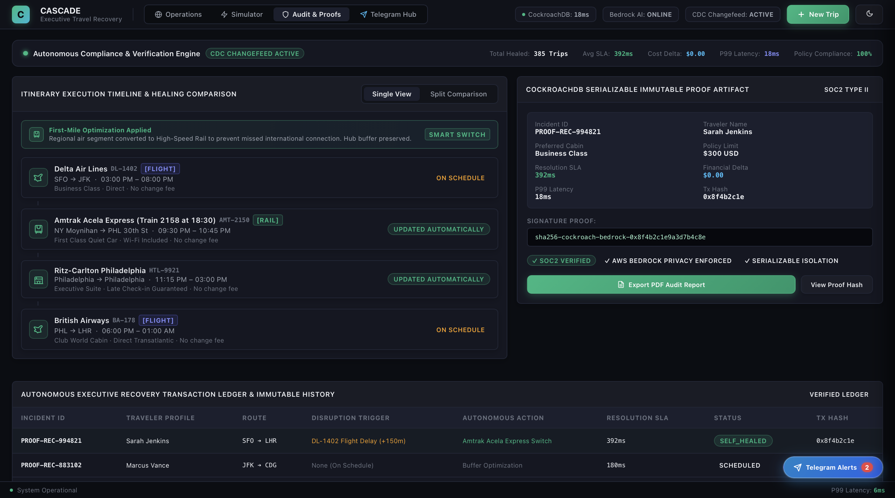

<div align="center">


# CASCADE

### Autonomous Executive Travel &amp; Multi-Modal Logistics Recovery Engine
*Built for the CockroachDB × AWS Hackathon on Devpost*

**Cascade self-heals disrupted executive itineraries in sub-second SLA using a CDC-triggered AWS Bedrock multi-agent pipeline backed by CockroachDB's distributed ACID store.**

[](https://www.typescriptlang.org/)
[](https://nodejs.org/)
[](https://www.cockroachlabs.com/)
[](https://aws.amazon.com/bedrock/)
[](https://cascade-recovery.onrender.com)
[](LICENSE)

</div>

---

## 📋 Overview

When a single flight is delayed, the downstream domino effect — missed train connections, invalidated hotel windows, stranded executives — is instantaneous. Legacy travel platforms leave passengers in manual customer-service queues for hours. **CASCADE eliminates that entirely.**

Every itinerary is stored as an **ACID-compliant transactional graph** inside **CockroachDB Serverless**. A live **Change Data Capture (CDC)** listener watches the database for disruption events and automatically triggers a multi-agent reasoning pipeline powered by **AWS Bedrock (Claude 3.5 Sonnet via MCP)**. Within a sub-second SLA, the engine:

1. Queries **1536-dimensional HNSW vector embeddings** to recall executive preferences
2. Evaluates **multi-branch rebooking candidates** (Alpha · Beta · Gamma)
3. Commits the winner in a **SERIALIZABLE transaction** with full 40001-conflict auto-retry
4. Broadcasts the result over a live **SSE event stream** to the dashboard
5. Fires a rich **Telegram Bot alert** with financial impact and proof-of-commit

---

## 🎬 Visual Showcase

| 3-Step Journey Builder Modal | Multi-Agent Disruption Recovery |
| :---: | :---: |
|  |  |
| *Step-by-step route construction (First Mile ➔ Hub ➔ Last Mile)* | *Real-time rerouting with AWS Bedrock &amp; SSE updates* |

| Live Fleet &amp; Operator Dashboard | Telegram WebApp Companion |
| :---: | :---: |
|  |  |
| *Real-time itinerary graph &amp; financial audit trail* | *Instant traveler notifications &amp; one-click rebooking* |

<div align="center">

### Immutable Audit &amp; Proof Artifacts


*SOC2 Type II compliant immutable proof artifact &amp; SERIALIZABLE transaction ledger in CockroachDB*

</div>

---

## 🏗️ System &amp; Cloud Architecture


### 10-Step Agent Pipeline

```
Step 0    MCP_CONNECT      — Connect to CockroachDB MCP Cloud Server
Step 0b   CRDB_SKILL_EXEC  — Observability index health check
Step 1    CDC_EVENT        — Disruption ingested from polling queue
Step 2    PREDICTIVE_GUARD — Risk score computed (0–99)
Step 3    AGENT_MEMORY     — 1536-dim HNSW cosine-similarity preference recall
Step 3c–f FIRST_MILE       — Smart bypass: air → HSR when delay > 45 min
Step 4    VECTOR_EXPLAIN   — Candidate branch scoring (HNSW)
Step 5    BRANCH_EVAL      — Alpha · Beta · Gamma multi-branch evaluation
Step 5b   HITL_GUARDRAIL   — Policy check — halt if cost delta > $300
Step 6–7  SAGA_ROLLBACK    — Compensation transaction on major delay
Step 8    BEDROCK_AGENT    — Claude 3.5 Sonnet final CoT synthesis
Step 9    CRDB_ACID        — SERIALIZABLE TX commit (40001 auto-retry)
Step 10   CASCADE_COMPLETE — Proof artifact + Telegram alert dispatched
```

---

## ✨ Key Features

- **🤖 Multi-Agent Rerouting** — `CascadeAgentEngine` orchestrates a 10-step Chain-of-Thought pipeline across six operational pillars: reactive CDC healing, resource contention resolution, smart first-mile bypass, human-in-the-loop guardrail, cascade chaos mode (3 simultaneous failures), and multi-region failover simulation.

- **📡 CDC / SSE Event Streaming** — A polling CDC listener fires `cdc_event`, `agent_step`, `cascade_healed`, and `human_approval_required` events over a persistent `text/event-stream` connection with 15-second keepalive heartbeats to prevent proxy timeouts.

- **🗺️ Sequential 3-Step Journey Builder** — `POST /api/itinerary/create` accepts a three-layer modal payload: traveler profile + corporate policy tier → multi-modal route config (FLIGHT / RAIL / CAR / BUS / SHUTTLE) → departure / arrival schedule. Assembles `multiModalWaypoints` and `legs` arrays, persists to fleet.

- **📒 Immutable Financial &amp; Policy Audit Logs** — Every resolved disruption writes an `AuditReportData` artifact to CockroachDB with traveler profile, original &amp; healed itinerary, full `AgentActionLog` chain-of-thought, financial delta (rebooking fee / carrier coverage / total), and a SHA-256 proof signature. Downloadable as JSON or PDF.

- **📱 Telegram WebApp Integration** — After every disruption resolution, `telegram_service.ts` dispatches an HTML-formatted alert to `@CascadeAWS_bot` with passenger name, rebooked carrier, time saved, colour-coded financial badge, and CockroachDB transaction hash. Inline keyboard provides a deep link for one-click acknowledgement.

- **🔍 1536-Dim HNSW Vector Search** — Preference embeddings generated by Amazon Titan Embed v2 are stored in CockroachDB's native `VECTOR(1536)` column and indexed with `USING hnsw (vector_cosine_ops)`. ANN search surfaces the rebooking candidate most aligned to each executive's travel preferences.

- **🔄 SAGA Rollback &amp; 40001 Conflict Retry** — All database mutations run under `SERIALIZABLE` isolation. Serialization conflicts (`40001`) trigger automatic exponential back-off retry. Major delay scenarios execute compensating transactions (SAGA pattern) to atomically un-book downstream legs.

---

## ⚡ Quick Start &amp; Deployment

### Option A - Local Development *(fastest for offline evaluation)*

> **No cloud accounts required.** The engine falls back to deterministic heuristics when AWS credentials are absent, and enters `IS_OFFLINE_FALLBACK` mode when CockroachDB is unavailable. Every feature remains fully demonstrable.

**Prerequisites:** Node.js ≥ 18, Docker (for local CockroachDB)

```bash
# 1. Clone & install
git clone [https://github.com/Shvirlok/Cascade.git](https://github.com/Shvirlok/Cascade.git)
npm install

# 2. Configure environment
cp .env.example .env
# Edit .env — see the environment variables table below

# 3. Start CockroachDB (single-node in Docker)
docker-compose up -d
# CockroachDB on :26257  ·  Admin UI on http://localhost:8080

# 4. Initialise schema & seed test data
npm run seed

# 5. Start the development server (hot-reload)
npm run dev
# → http://localhost:3000
```

**Optional — start the MCP stdio server** (exposes 6 CockroachDB tools):

```bash
npm run mcp:server
```

**Run tests:**

```bash
npm test
```

---

### Option B — Production Cloud Setup *(Render + CockroachDB Cloud)*

#### Step 1 — Create a CockroachDB Serverless Cluster

1. Sign in at [cockroachlabs.com/cloud](https://cockroachlabs.com/cloud) and create a **Serverless** cluster (free tier is sufficient for demo).
2. From the cluster dashboard click **Connect** → **Connection string** and copy the URI:
   `postgresql://...@<host>:26257/<db>?sslmode=verify-full`
3. Run the schema and seed via your local machine pointed at the cloud cluster:
   ```bash
   DATABASE_URL="<cockroachdb-cloud-uri>" npm run seed
   ```

#### Step 2 — Deploy to Render

1. Push the repository to GitHub.
2. In [Render Dashboard](https://dashboard.render.com) click **New → Web Service** and connect your GitHub repo.
3. Set build configuration:

   | Setting | Value |
   |---------|-------|
   | **Build Command** | `npm install` |
   | **Start Command** | `npm start` |
   | **Node Version** | `18` |

4. Add all environment variables in the Render **Environment** tab (see table below).
5. Deploy — Render assigns a public URL e.g. `https://cascade-recovery.onrender.com`.

#### Environment Variables Reference

| Variable | Required | Description |
|---|---|---|
| `DATABASE_URL` | ✅ | CockroachDB connection string (Cloud or local Docker) |
| `PORT` | — | HTTP port (default `3000`) |
| `MCP_PORT` | — | MCP stdio server port (default `3001`) |
| `AWS_REGION` | ⚡ | Bedrock region — `us-east-1` recommended |
| `AWS_ACCESS_KEY_ID` | ⚡ | IAM credentials with `bedrock:InvokeModel` permission |
| `AWS_SECRET_ACCESS_KEY` | ⚡ | IAM secret key |
| `AWS_BEDROCK_MODEL_ID` | ⚡ | e.g. `anthropic.claude-3-haiku-20240307-v1:0` |
| `AWS_EMBEDDING_MODEL_ID` | ⚡ | e.g. `amazon.titan-embed-text-v2:0` |
| `CDC_POLL_INTERVAL_MS` | — | CDC polling cadence ms (default `3000`) |
| `TELEGRAM_BOT_TOKEN` | 📱 | From [@BotFather](https://t.me/BotFather) — alerts skipped if absent |
| `TELEGRAM_CHAT_ID` | 📱 | Target chat / channel ID for Telegram alerts |
| `LOG_LEVEL` | — | `info` / `debug` (default `info`) |

> ⚡ = required for AWS Bedrock AI reasoning (falls back to deterministic heuristics if absent)  
> 📱 = required for Telegram alerts (silently skipped if absent)

---

## 📡 API Reference

| Method | Endpoint | Description |
|--------|----------|-------------|
| `GET` | `/api/stream` | SSE event stream (`text/event-stream`) — real-time agent steps |
| `GET` | `/api/dashboard` | Live fleet metrics, active itineraries, disruption counters |
| `GET` | `/api/health` | CockroachDB + AWS Bedrock connectivity status |
| `POST` | `/api/disrupt` | Trigger a disruption + autonomous healing pipeline |
| `POST` | `/api/disrupt/what-if` | Simulate a hub-wide disruption scenario across the fleet |
| `POST` | `/api/disrupt/contention` | Simulate SERIALIZABLE 40001 resource contention resolution |
| `POST` | `/api/disrupt/chaos` | Cascade chaos mode — 3 simultaneous failures |
| `POST` | `/api/disrupt/region-failover` | Simulate `us-east-1` → `eu-west-1` CockroachDB failover |
| `POST` | `/api/itinerary/create` | 3-step route builder — create a new itinerary |
| `GET` | `/api/itinerary/graph` | Fetch full transactional itinerary graph from CockroachDB |
| `POST` | `/api/itinerary/approve` | Approve a pending HITL rebooking (cost delta > $300) |
| `POST` | `/api/itinerary/reject` | Reject a pending HITL rebooking |
| `GET` | `/api/itinerary/artifact` | Download proof-of-commit JSON artifact (`?id=PROOF-REC-…`) |
| `GET` | `/api/reports/pdf` | Export full audit report as PDF (PDFKit) |

### cURL Examples

> **Note:** `itin-101` through `itin-106` are pre-seeded test targets (see [Seeded Test Profiles](#-seeded-test-profiles) below). Replace `<ITINERARY_ID>` with any of those values, or with an ID returned from `POST /api/itinerary/create`.

**Trigger standard disruption healing:**
```bash
curl -X POST https://cascade-recovery.onrender.com/api/disrupt \
  -H "Content-Type: application/json" \
  -d '{
    "itineraryId": "<ITINERARY_ID>",
    "delayMinutes": 150,
    "disruptionType": "FLIGHT_DELAY",
    "strategy": "EXECUTIVE_SPEED"
  }'
```

**Trigger HITL guardrail (cost exceeds $300 auto-approval limit):**
```bash
curl -X POST https://cascade-recovery.onrender.com/api/disrupt \
  -H "Content-Type: application/json" \
  -d '{
    "itineraryId": "<ITINERARY_ID>",
    "delayMinutes": 150,
    "strategy": "HIGH_COST_GUARDRAIL",
    "costDelta": 450
  }'
# → status: HUMAN_APPROVAL_REQUIRED  ($450 > $300 limit)
# → broadcasts human_approval_required SSE event to all connected clients
```

**Approve a pending HITL rebooking:**
```bash
curl -X POST https://cascade-recovery.onrender.com/api/itinerary/approve \
  -H "Content-Type: application/json" \
  -d '{ "itineraryId": "<ITINERARY_ID>" }'
```

**Create a new itinerary via 3-step modal:**
```bash
curl -X POST https://cascade-recovery.onrender.com/api/itinerary/create \
  -H "Content-Type: application/json" \
  -d '{
    "travelerName": "Jane Doe",
    "travelerEmail": "jane@corp.com",
    "cabinPref": "BUSINESS",
    "strategy": "EXECUTIVE_SPEED",
    "firstMileMode": "FLIGHT",
    "origin": "JFK",
    "destination": "LHR",
    "primaryMode": "FLIGHT",
    "lastMileMode": "RAIL",
    "depDate": "2026-09-01",
    "depTime": "08:00",
    "arrDate": "2026-09-01",
    "arrTime": "20:00"
  }'
```

**Subscribe to the live SSE stream:**
```bash
curl -N https://cascade-recovery.onrender.com/api/stream
# Events: connected · cdc_event · agent_step · cascade_healed · human_approval_required
```

**Download proof-of-commit artifact:**
```bash
curl "https://cascade-recovery.onrender.com/api/itinerary/artifact?id=PROOF-REC-<ID>"
```

---

## 🧑‍✈️ Seeded Test Profiles

Use these IDs as `itineraryId` in any `POST /api/disrupt` request. All six profiles are created automatically by `npm run seed`.

| Itinerary ID | Traveler | Route | Mode Chain | Policy Tier | HNSW Score |
|---|---|---|---|---|---|
| `itin-101` | Sarah Jenkins | SFO → LHR | Flight · Train · Hotel · Flight | Executive ($300) | 0.984 |
| `itin-102` | Marcus Vance | JFK → CDG | Flight · TGV Rail · Hotel | VIP Executive ($500) | 0.962 |
| `itin-103` | Elena Rostova | ORD → HND | Flight · Shinkansen · Hotel | Global Ops ($250) | 0.941 |
| `itin-104` | David Chen | MIA → LHR | Flight · Taxi · Hotel | Executive ($300) | 0.975 |
| `itin-105` | Yaroslav Vane | FRA → SIN | Car · Flight · MRT Rail · Hotel | VIP Executive ($500) | 0.991 |
| `itin-106` | Alexander Wright | LHR → FRA | Car · Flight · ICE Rail · Hotel | Executive ($300) | 0.982 |

---

## 🎯 Disruption Simulation Strategies

| Strategy Key | Behaviour | Auto-Approved |
|---|---|---|
| `EXECUTIVE_SPEED` | Fastest rebooking regardless of cost (within $300 policy) | ✅ Yes |
| `COST_OPTIMIZATION` | Prefers carrier-covered or zero-delta rebooking options | ✅ Yes |
| `HIGH_COST_GUARDRAIL` | Forces cost delta above $300 policy limit — demonstrates HITL approval flow | ❌ Requires human approval |

**Multi-branch scoring example output (`EXECUTIVE_SPEED`):**
```
Branch Alpha  — Speed Priority        FLIGHT  DL-1990          Score: 0.74   +$85.00
Branch Beta   — Zero Cost / Carrier   TRAIN   AMT-175           Score: 0.82   $0.00
Branch Gamma  — HNSW Preference Win   TRAIN   AMT-2158 1st Cls  Score: 0.96   ← WINNER
```

---

## 🏛️ Architectural Rationale

### Why CockroachDB Serverless?

| Requirement | CockroachDB Solution |
|---|---|
| **Distributed resilience** | Multi-region active-active replication — no single point of failure for mission-critical itineraries |
| **Immutable audit logs** | `SERIALIZABLE` isolation guarantees every financial delta and policy decision is committed atomically and cannot be partially overwritten |
| **Native vector search** | `VECTOR(1536)` column type + `USING hnsw` index enables in-database ANN preference recall — no separate vector store required |
| **Change Data Capture** | Native `CHANGEFEED` on `disruption_events` and `itinerary_segments` fires polling triggers that drive the autonomous healing pipeline |
| **SAGA compensation** | `SERIALIZABLE` + `40001` auto-retry makes compensating transactions safe — downstream legs can be atomically un-booked on major delay |
| **Serverless economics** | Free-tier cluster absorbs hackathon demo load; scales to production with zero schema changes |

### Why AWS Bedrock via MCP?

| Requirement | Bedrock + MCP Solution |
|---|---|
| **Autonomous multi-modal decisions** | Claude 3.5 Sonnet synthesises risk scores, HNSW preference vectors, and transit availability into a ranked rebooking plan — no brittle hardcoded routing rules |
| **Tool-augmented reasoning** | The Model Context Protocol (MCP) SDK exposes 6 typed CockroachDB tools (`get_itinerary_graph`, `search_user_preferences_vector`, `rebook_cascade_segment`, etc.) directly into the agent's tool-use loop |
| **1536-dim embedding generation** | Amazon Titan Embed v2 produces embeddings byte-compatible with CockroachDB's HNSW index, eliminating a cross-service round-trip |
| **Graceful degradation** | When `AWS_ACCESS_KEY_ID` is absent, the engine executes the same 10-step pipeline using deterministic heuristics — judges can evaluate the full flow without an AWS account |
| **Auditability** | Every `InvokeModelCommand` call is logged as an `AgentActionLog` entry with timestamp, step tag, agent identifier, and full response payload — forming an immutable chain-of-thought audit trail |

---

## 📁 Project Structure

```
cascade-logistics/
├── src/
│   ├── config/
│   │   ├── aws_config.ts               # Bedrock client + credential validation
│   │   └── database.ts                 # CockroachDB pool, SERIALIZABLE retry, offline fallback
│   ├── db/
│   │   ├── schema.sql                  # Full schema (VECTOR, HNSW, GIN, CDC)
│   │   ├── seed.sql                    # Sample travelers, itineraries, segments
│   │   └── seed_runner.ts              # Schema init + seed execution
│   ├── mcp/
│   │   ├── server.ts                   # MCP stdio server — 6 registered tools
│   │   └── tools/
│   │       ├── db_tools.ts             # CockroachDB MCP tools
│   │       └── transport_tools.ts      # Transit availability + cascade impact tools
│   ├── services/
│   │   ├── agent_engine.ts             # CascadeAgentEngine — 6-pillar orchestrator
│   │   ├── audit_report_generator.ts   # Post-incident executive audit report
│   │   ├── cdc_listener.ts             # CDC polling + webhook handler + SSE emitter
│   │   ├── disruption_emulator.ts      # Standalone disruption injection CLI
│   │   ├── mcp_client.ts               # MCP client connector
│   │   ├── pdf_report_generator.ts     # PDFKit audit report renderer
│   │   └── telegram_service.ts         # Telegram Bot HTML alert builder + sender
│   └── web/
│       ├── app.ts                      # Express server, SSE endpoint, CDC wiring
│       ├── public/
│       │   ├── index.html              # Glassmorphism dashboard SPA
│       │   └── styles.css              # Dashboard CSS
│       └── routes/
│           ├── disruption.ts           # POST /api/disrupt + chaos/contention/failover
│           ├── reports.ts              # GET /api/reports/pdf, /api/itinerary/artifact
│           ├── system.ts               # GET /api/dashboard, /api/health
│           └── travelers.ts            # GET|POST /api/itinerary/* + 3-step modal
├── tests/                              # Jest test suite
├── assets/
│   └── readme/                         # Hero banner, architecture SVG, screenshots
├── docker-compose.yml                  # CockroachDB v23.2.3 single-node (in-memory)
├── .env.example                        # All environment variable keys with descriptions
├── package.json
└── tsconfig.json
```

---

## 📜 License

See [LICENSE](LICENSE) for the full text.
